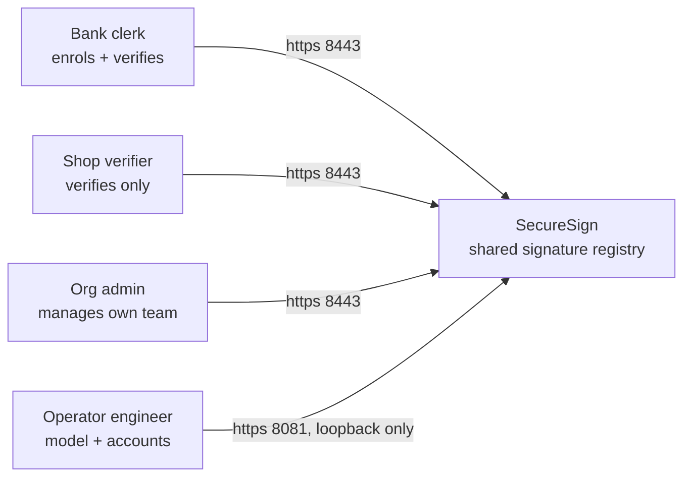
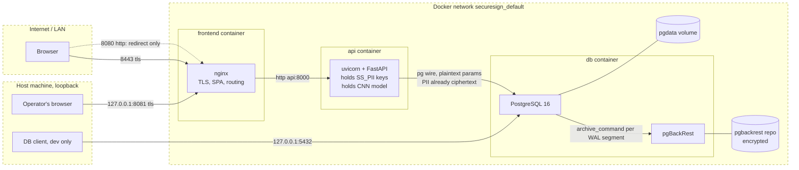
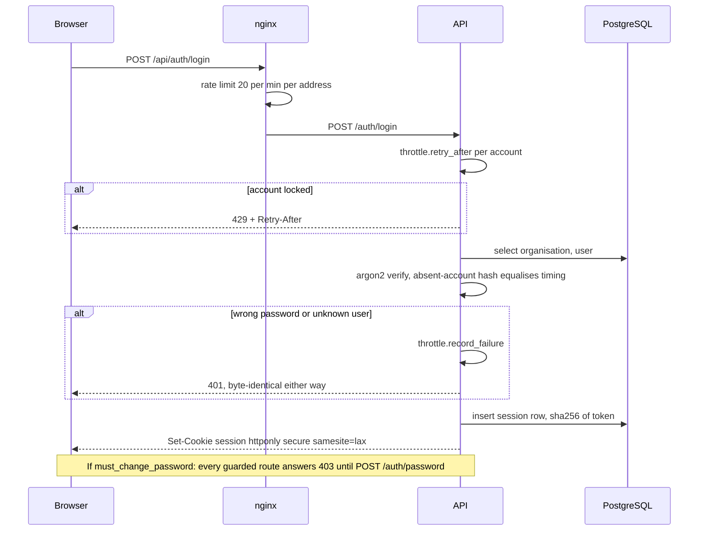
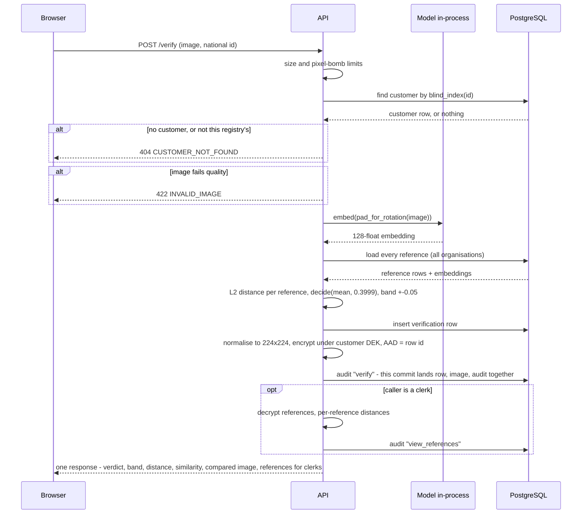
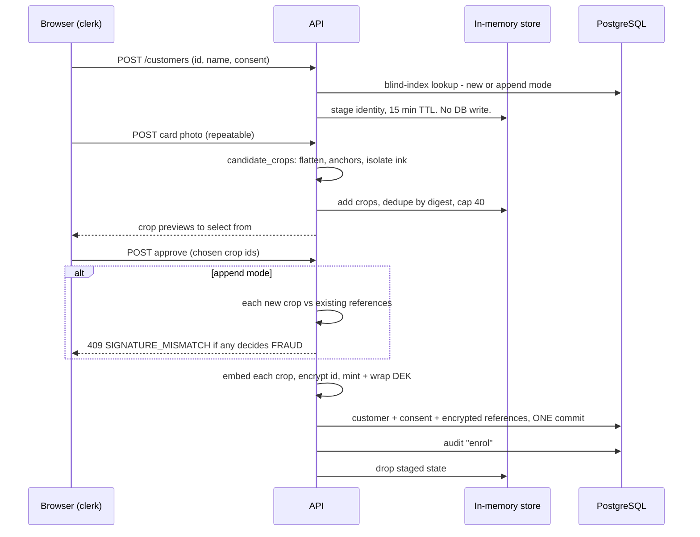
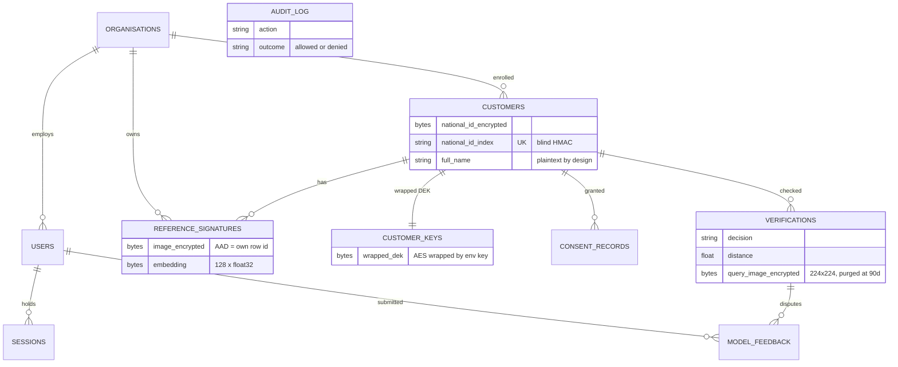
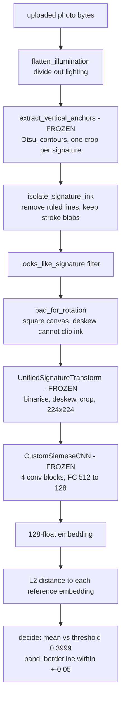

# Architecture

How SecureSign is built: top-down from the system boundary to the code, then bottom-up
from a signature pixel to a verdict row.

**Companion documents:** [README.md](README.md) - what the system is ·
[DEPLOYMENT.md](DEPLOYMENT.md) - how to run it.

Code names in this file are grep-stable symbols, not links - search for them.

| Section | The question it answers |
|---|---|
| [Bird's eye view](#birds-eye-view) | What is this, and which three goals outrank everything else? |
| [System context](#system-context) | Who talks to it? |
| [Containers and trust boundaries](#containers-and-trust-boundaries) | Where are the walls, and what crosses them? |
| [Key custody](#key-custody) | Which key lives where, and what dies with it? |
| [Runtime scenarios](#runtime-scenarios) | Sign-in, verification, enrolment - step by step |
| [Data model](#data-model) | Which tables exist, and why they relate the way they do |
| [Bottom-up: a pixel becomes a verdict](#bottom-up-a-pixel-becomes-a-verdict) | The model pipeline, and what in it is frozen |
| [Code map](#code-map) | Which directory owns what |
| [Cross-cutting invariants](#cross-cutting-invariants) | Rules no single directory owns |

## Bird's eye view

SecureSign is an offline handwritten-signature verification service run as a shared
registry. A financial institution enrols a customer from a specimen card; any subscribing
organisation can then verify a signature against every institution's references and
receives a verdict (VALID / FRAUD / BORDERLINE), a distance, and a similarity figure.
One CNN embeds signature images into 128-dimensional vectors; verification is the mean
L2 distance between a query embedding and one customer's reference embeddings, compared
against a fixed threshold.

Three quality goals rank above everything else:

1. **Confidentiality of PII and signatures** - national IDs and signature images are
   ciphertext at rest; the keys never live beside the data.
2. **Tenant isolation** - an organisation can never learn anything about another
   organisation's records, including whether they exist.
3. **Verifiability of decisions** - every verdict is persisted with the exact image the
   model compared, every sensitive read is audited, and the audit log is append-only.

The system deliberately **fails closed**: with the database unreachable, every request
answers 503. There is no cache and no degraded mode, because a verdict served from stale
data is a security check that fails open.

## System context



No third-party systems. The model runs in-process; there are no outbound calls at all.

## Containers and trust boundaries

Three containers on one private Docker network. Dashed boxes are trust boundaries;
every arrow crossing one is doing authentication, validation, or both.



Boundary claims, each load-bearing:

- **The api container publishes no port.** nginx is the only path to it. The four
  internal route families (`/engineering`, `/api/engineering`, `/accounts`, `/api/admin`)
  plus the OpenAPI schema return **404 on the public listener** and exist only on
  `127.0.0.1:8081`. This is a *deployment* control: the application cannot tell callers
  apart (every request arrives from the nginx container) and deliberately does not try -
  a header-based caller check is forgeable by anyone who reaches the API directly.
- **The db container gets exactly five environment variables**, named one by one - never
  `env_file`, which would put `SS_PII_ENC_KEY` beside the ciphertext it protects.
- **Traffic inside the network is plaintext protocols carrying ciphertext data**: the
  national ID is sealed by the application before the SQL is sent, so the database link
  never carries a plaintext identifier. The exception is `full_name`, plaintext by
  design everywhere.

## Key custody

| Key | Lives | Protects | If lost |
|---|---|---|---|
| `SS_PII_ENC_KEY` | api env only | national IDs (AES-256-GCM) **and** wraps every customer DEK | every ID and image unreadable, forever |
| `SS_PII_INDEX_KEY` | api env only | the blind HMAC index that makes encrypted IDs searchable | lookups impossible until re-indexed from decrypted IDs |
| per-customer DEK | `customer_keys.wrapped_dek`, ciphertext | that customer's signature images | deleting one row = erasing that customer's images everywhere, backups included |
| `BACKUP_REPO_PASSPHRASE` | db env only | the pgBackRest repository (AES-256-CBC) | every backup unreadable |
| TLS pair `deploy/tls/` | frontend bind mount | transport on 8443/8081 | regenerated self-signed on next start |
| session tokens | browser cookie; DB stores sha256 only | authentication | user signs in again |

Ciphertext binding: signature images carry their own **row id as AES-GCM additional
authenticated data** - a ciphertext moved onto another row fails to decrypt instead of
impersonating someone else's signature.

## Runtime scenarios

### Sign-in and the one-time password rule



Accounts are provisioned with a generated one-time password shown exactly once
(`generate_handover_password`, ~79 bits). Nothing works until the owner replaces it -
enforced in `require_roles`, the one chokepoint every real endpoint passes through.

### Verification, the core flow



Storing the compared image is **best-effort by design**: a verdict must never fail to be
recorded because storing the picture behind it did. The stored picture is the 224×224 the
model actually read - never the photograph - and is purged after 90 days while the verdict
row is permanent.

### Enrolment, staged then atomic



Nothing touches the database until approve; a wizard abandoned mid-way leaves no rows.
The cost: staged state (including the plaintext ID and crops) lives in **process
memory** - a restart loses in-flight enrolments, and a second API worker would 404 the
wizard. Single-process is an architecture invariant until this moves out of memory.

## Data model



`audit_log` has **no foreign keys** on purpose: the trail outlives the accounts it names.
Customers soft-delete (`status`), so history stays referentially intact. Schema changes
are additive only, through `migrate.py`, with SQLAlchemy types compiled per dialect.

## Bottom-up: a pixel becomes a verdict



**Architecture Invariant: the frozen pipeline.** `anchors.py`, `preprocess.py` and
`embed.py` are shared with training. Cleanup and validation wrap them, never enter them,
or the weights stop matching what they were fitted to. `tests/test_cleanup.py` reads
their source and fails if cleanup leaks in. Enrolment and verification must prepare
images through the same chain - a reference and a query prepared differently are not
comparable, and a test enforces that too.

## Code map

```
securesign/
├── backend/app/            the API
│   ├── main.py             create_app factory: keys checked, schema, model, routers
│   ├── routers/            HTTP endpoints + role guards, one file per surface
│   ├── services/           enrolment, verification, accounts, engineering
│   ├── repositories/       queries; audit.py is the append-only trail
│   ├── auth/               sessions, argon2, login throttle, require_roles
│   ├── security/           crypto.py + envelope.py, ~75 lines, all of the crypto
│   ├── models_db.py        schema, as_utc / iso_utc
│   └── migrate.py          additive-only column adds, dialect-compiled
├── packages/signature_core/  the model pipeline, importable as signature_core
├── frontend/src/           Vue 3 SPA
├── deploy/                 Dockerfiles, pgbackrest.conf, tls/
├── scripts/                bootstrap, seeds, migration, backup drill, re-embed
└── tests/                  one suite, runs on SQLite and on PostgreSQL
```

### backend/app

Layered by convention - `routers → services → repositories → models_db` - not by
enforcement: routers query repositories directly, and `auth.py` runs its own ORM
selects. That looseness is accepted. What is not negotiable is that crypto lives only
in `security/` (+ the DEK handling in `repositories/customer_keys.py`) and org scoping
lives only in the repository query helpers.

- `routers/` - request/response shape, role guards, nothing clever.
- `services/` - the flows: `enrolment.py` (staged wizard, atomic approve),
  `verification.py` (the verify pipeline, retention purge), `accounts.py` (provisioning,
  password policy), `engineering.py` (aggregates only, never a name or an image).
- `auth/deps.py` - `require_roles`, the single chokepoint: role check, and the
  must-change-password gate that makes a handed-out password useless for anything else.
- `security/` - `seal`/`unseal` (AES-256-GCM), `blind_index` (HMAC), DEK wrap/unwrap.

> **Invariant - audit is the commit.** `repositories/audit.py` `write()` commits the
> session. Every audit call is a transaction boundary, and `verification.run` relies on
> it to land the verdict, the image, and the audit row atomically. Move an audit call
> and you move a commit.

### packages/signature_core

| Module | Role | Frozen |
|---|---|---|
| `anchors.py` | find signature regions on a specimen card | **yes** |
| `preprocess.py` | `UnifiedSignatureTransform`: binarise, deskew, crop, 224×224 | **yes** |
| `embed.py`, `model.py` | the CNN, image → 128 floats | **yes** |
| `cleanup.py` | illumination flattening, ink isolation, `candidate_crops` | no |
| `quality.py` | is this decodable, lit, signature-shaped | no |
| `decision.py` | threshold 0.3999, borderline band ±0.05 | no |

> **Invariant - the frozen pipeline.** The frozen modules are shared with training;
> cleanup wraps them and never enters them, or the weights stop matching what they were
> fitted to. `tests/test_cleanup.py` reads their source and fails on contamination.
> The band is decided server-side and never recomputed by a client.

### frontend/src

- `router.js` + `accessRules.js` - role-guarded routes; the role table is plain data so
  it can be checked headlessly.
- `auth.js` - session state; mirrors the server's `IMPLIED_ROLES` so an org_admin sees
  the navigation its organisation type earns.
- `api.js` - the one HTTP client: `/api` base, error envelope, 401 clears the session.

> **Invariant - the build gate.** `npm run build` runs `routing.check.mjs` first: a
> routing rule that would strand an account fails the Docker image build itself.

### deploy/ and scripts/

- `deploy/Dockerfile` - CPU-only torch installed *before* the source layers, so a code
  edit never reinstalls it. `db.Dockerfile` - postgres + pgBackRest + stanza init.
  `tls/` - bind-mounted; a self-signed pair is generated on first start if empty,
  production drops a real pair in and the generator no-ops.
- `scripts/` - each operational script verifies its own work: the SQLite→PostgreSQL
  migration digest-checks every ciphertext row and ends with a decrypt test including a
  negative wrong-AAD control; `backup_drill.sh` restores into a scratch container and
  proves a reference still decrypts; `reembed_references.py` exists because references
  are stored at cut resolution precisely so embeddings can be rebuilt when the
  transform changes.

## Cross-cutting invariants

Rules that no single directory owns. Each is enforced somewhere concrete - grep the
name to find it.

**404, never 403.**
A record belonging to another organisation answers 404 - a 403 confirms the identifier
exists, which is itself a leak. Scope always derives from the session, never from
anything in the request. Enforced in the `get_scoped` / `get_for_org` query helpers;
probed by `tests/test_idor.py`.

**Every image read is audited. Sign-in is not.**
Reference views, verification details, the stored compared image - each read writes an
audit row, and denials are recorded with `outcome: denied`. Login writes no audit row -
only throttle state. The code states no rationale; the observable consequence is that an
unauthenticated endpoint cannot grow the audit log.

**Fail closed, and say which failure it is.**
Database unreachable → `503` with `Retry-After`, never a cached or degraded answer - a
verdict from stale data is a security check failing open. `/health` is process-only
liveness (a restart cannot fix a dead database); `/ready` is the database-touching
signal for monitors. A database that is *late* is handled by the restart policy, not by
in-app retry loops: the API fails loudly and the platform relaunches it.

**Timestamps carry their zone.**
Read through `as_utc`, serialised through `iso_utc`. SQLite returns naive datetimes,
PostgreSQL aware ones, and a uniform shift preserves ordering - nothing on screen looks
wrong while a retention purge deletes early. That failure mode is why the helpers exist.

**Erasure is key destruction.**
Deleting a `customer_keys` row voids that customer's images in the live database and in
every backup ever taken, at once. Honest current state: the primitive
(`customer_keys.destroy`) exists and is tested, but no production endpoint calls it -
`DELETE /customers/{id}` soft-deletes only.

**One process, and it matters.**
The login throttle, staged enrolments (plaintext ID and crops included), and the
retention-purge timer live in process memory. Correct at exactly one API instance;
the first things that must move out of process if the API ever scales horizontally.

**Accepted asymmetries.**
The internal 8081 listener sends no security headers on `/api/` responses and does not
edge-throttle login - being reachable only from the host loopback *is* the control.
`/verify` embeds whatever image it is given; ink isolation happens in `/verify/regions`,
and the two preparations converge only when the client routes through region selection -
by design, because only the clerk knows which mark on a page is the signature.
