<table>
  <tr>
    <td align="center">
      
    </td>
    <td valign="center">
      <h1>SecureSign</h1>
      <h3>Financial Signature Verification & Forgery Detection Portal</h3>
    </td>
  </tr>
</table>

<div align="center">

[](https://www.python.org)
[](https://fastapi.tiangolo.com/)
[](https://vuejs.org/)
[](https://www.postgresql.org/)
[](https://pytorch.org/)
[](https://opencv.org/)
[](https://docs.docker.com/compose/)
[](https://nginx.org/)
[](https://pgbackrest.org/)
[](ARCHITECTURE.md)

**Offline handwritten-signature verification as a shared registry.**
A bank enrols a customer once; every subscribing organisation verifies against the
same references and sees only its own records.

</div>

---

## About The Project

SecureSign is an end-to-end signature-forgery detection system built around a custom
**Siamese Convolutional Neural Network**. A financial institution enrols a customer
from a photographed specimen card; any subscribing organisation - another bank, a shop,
a back office - submits a photographed signature and receives a verdict
(**VALID / FRAUD / BORDERLINE**), a distance score, and a similarity percentage, in
about a second, entirely offline.

The system runs as a hardened multi-organisation web platform: FastAPI + PyTorch
serving the model, Vue 3 behind an nginx TLS terminator, PostgreSQL with encrypted
PII and continuous point-in-time backups - all in Docker Compose.

This system was developed as a comprehensive academic capstone project by **Raz Natanzon** and **Daniel Grigoriev**.

## Key Features

- **Enrolment from a specimen card** - a clerk photographs a card of 8–10 signatures;
  the system finds, crops and previews each one, and the clerk approves what is stored.
- **One-second verification** - a signature is isolated out of the photograph, compared
  against every reference on file, and explained: per-reference distances, closest-first,
  with the decision line drawn on a scale.
- **Three-outcome verdicts** - a distance within ±0.05 of the threshold is called
  **BORDERLINE**, because a coin-flip from an 84%-accurate model should say so.
- **Shared registry, scoped visibility** - every organisation verifies against all
  references; each sees only the customers and history it is entitled to. A record
  belonging to another organisation answers 404, never 403.
- **Verification history with a feedback loop** - every check is recorded with the
  exact image the model compared (kept 90 days); institutions flag verdicts they
  believe were wrong, and the engineering panel triages them as training signal.
- **Engineering panel** - aggregate model behaviour, distance-distribution histogram
  against the threshold, verdict bands, dispute queue and account provisioning; served
  only on the host loopback, invisible from the network.
- **Role-based access** - clerk, verifier, org admin and engineer each see exactly
  their own workspace; new accounts get a one-time generated password shown exactly once.

## Screenshots

### Sign in
Every user belongs to an organisation; access is issued, never self-registered.

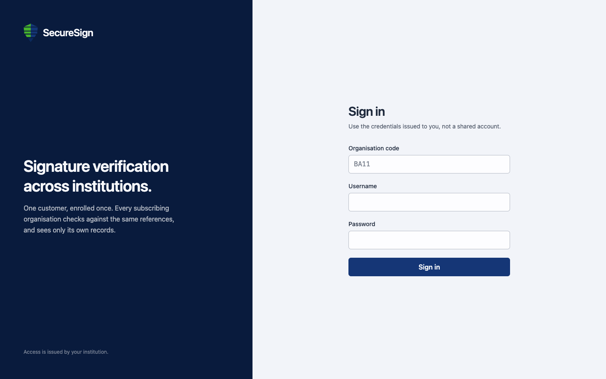

### Verifying a signature
The verdict, the distance on a scale against the decision line, and the questioned
signature next to every reference on file, closest first. The teller records what
actually happened at the counter - that feedback is how the model's blind spots surface.

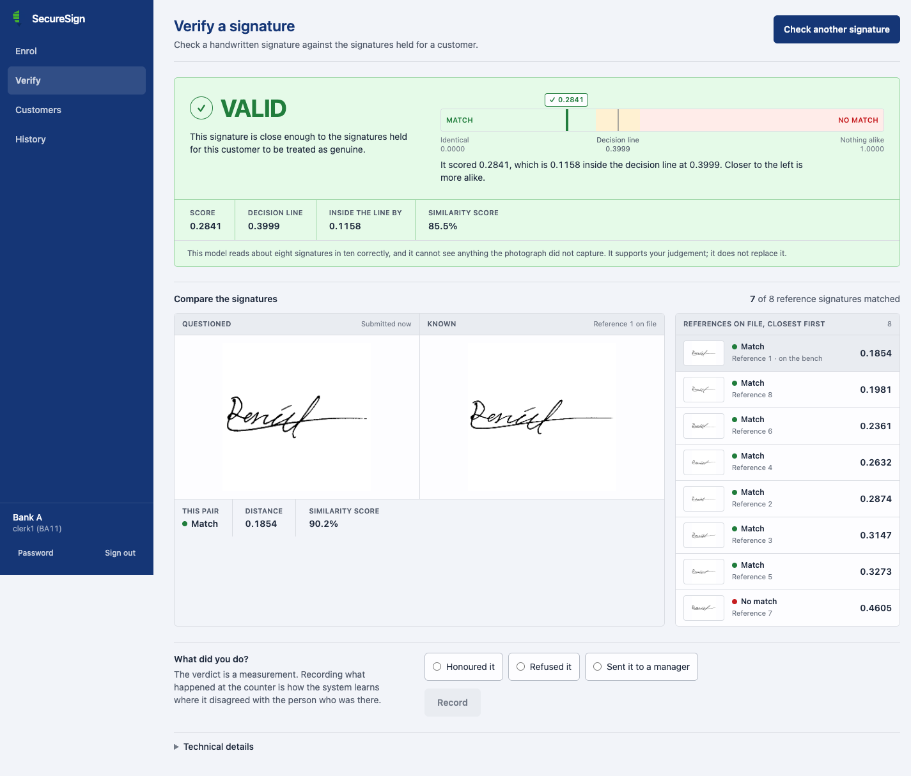

Before the check runs, the system shows exactly what will be compared - the signature
it cut out of the photograph, not the photograph:

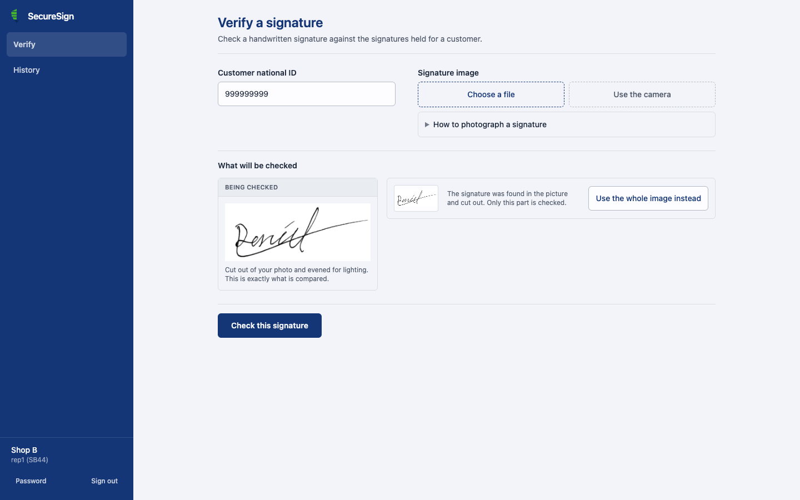

### Enrolling a customer
A three-step wizard: identity and consent, the photographed specimen card, then
approving the signatures the system found on it.

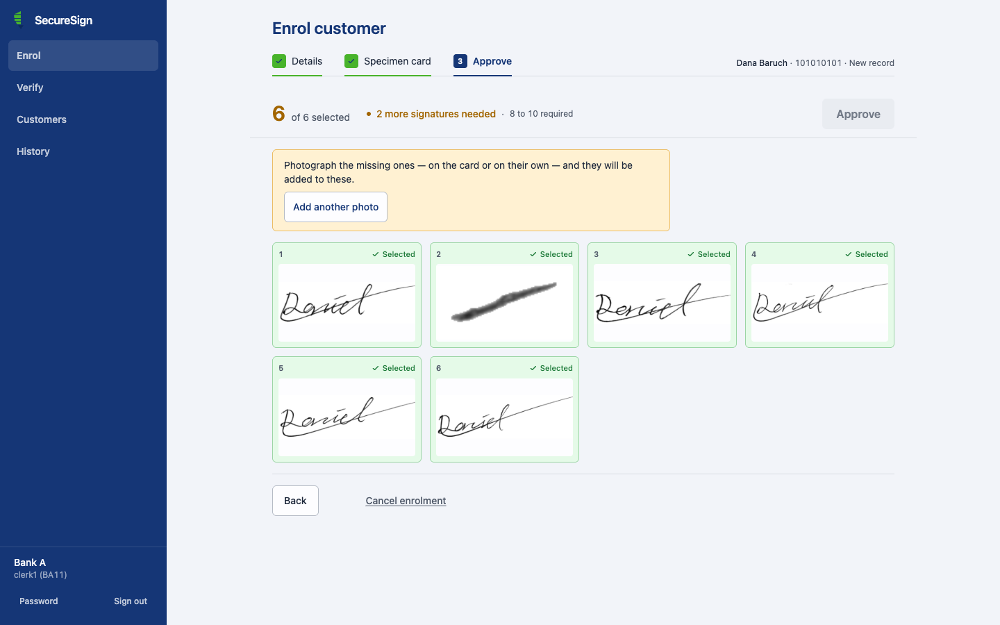

### Customer registry
Reference signatures the organisation holds, looked up by national ID - there is no
browsable customer list, by design.

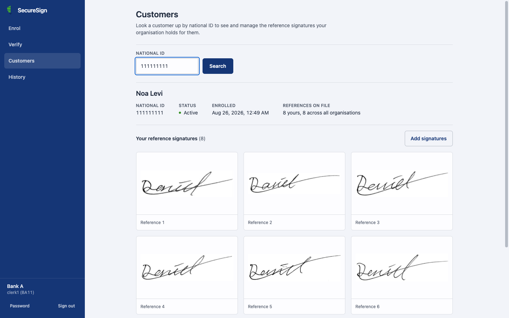

### Verification history
Every check the organisation has run: verdict, distance, similarity, who checked and
when. VALID, FRAUD and BORDERLINE all visible at a glance.

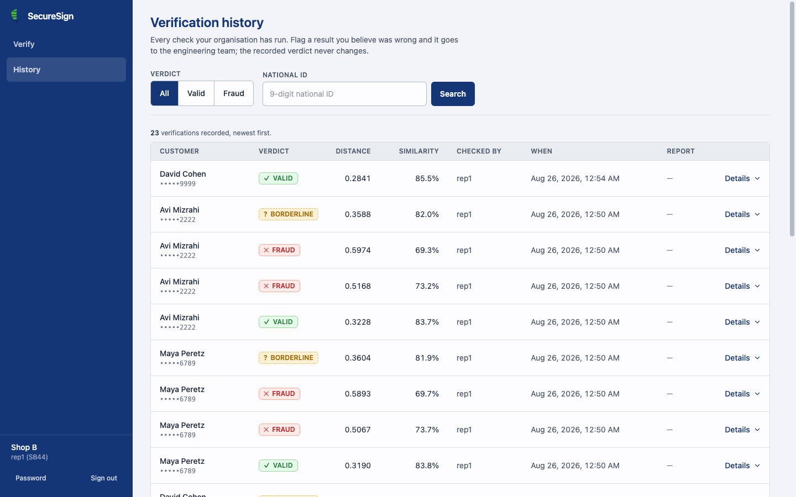

### Team management
An org admin manages only their own organisation's accounts. New users get a
generated one-time password, shown once - nobody chooses another account's password.

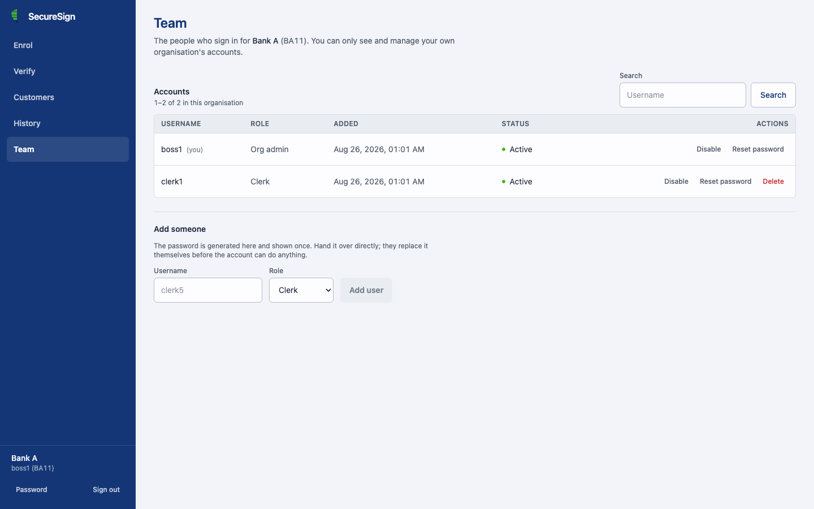

### Engineering panel (internal only)
Aggregate model behaviour: where distances actually land against the threshold, verdict
bands, and the dispute queue. Holds no customer names, identifiers or signature images,
and is reachable only from the host machine.

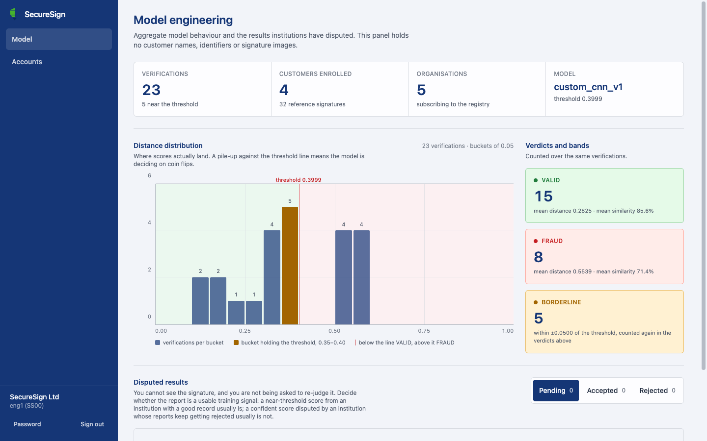

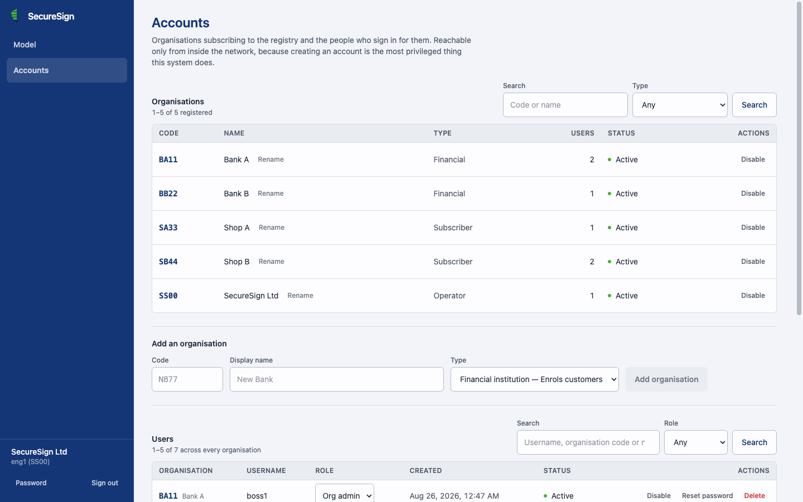

### Mobile
The whole portal is responsive - a teller can verify from a phone at the counter,
including using the camera directly.

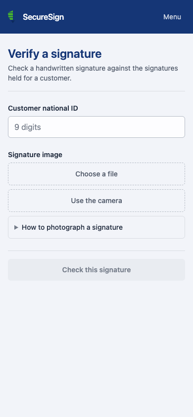

## Architecture

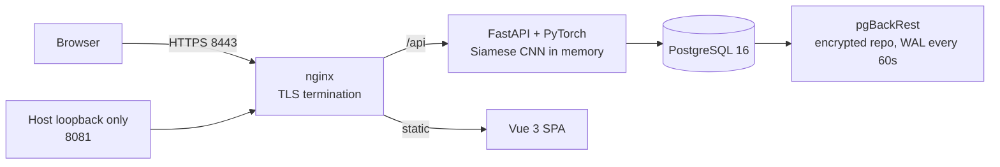

- **nginx** terminates TLS and splits the world in two: the public listener serves the
  application and returns 404 for `/engineering`, `/accounts`, `/api/admin` and the
  OpenAPI schema; the internal listener carrying those panels is published only on
  `127.0.0.1:8081`.
- **The API container publishes no port of its own** - every request passes through nginx.
- **PII is envelope-encrypted**: national IDs under AES-256-GCM with a blind HMAC index
  for lookup; every customer's signature images under a per-customer key that is stored
  only wrapped. Deleting a customer's key row erases their signatures everywhere at
  once - live database and every backup - by making the ciphertext meaningless.
- **Backups are continuous and rehearsed**: every WAL segment ships to an encrypted
  pgBackRest repository as it closes (forced at least every 60 s), so a disaster loses
  about a minute, not a day. `scripts/backup_drill.sh` proves the restore path works,
  down to decrypting a reference image from the restored copy.

The full write-up - trust boundaries, key custody, sequence diagrams, ER model and the
invariants the codebase must keep - is in **[ARCHITECTURE.md](ARCHITECTURE.md)**.

## Getting Started

Everything runs in Docker; nothing is installed on the machine except Docker itself.

```bash
git clone <repository-url> securesign
cd securesign
cp .env.example .env        # fill the five secrets: openssl rand -hex 32 for each
docker compose up -d --build
```

The API loads the model at startup - expect 30–60 s before
`https://localhost:8443/api/health` answers `"model_loaded": true`. Then create the
first account:

```bash
docker compose exec api python scripts/bootstrap.py
```

and sign into the engineering panel at `https://localhost:8081` to create institutions
and users. The step-by-step guide, including what each secret does and a
troubleshooting table, is in **[DEPLOYMENT.md](DEPLOYMENT.md)**.

### Tests

```bash
.venv/bin/python -m pytest tests/ -q -m "slow or not slow"   # backend, both DB dialects supported
cd frontend && npm run check                                  # frontend type/consistency checks
```

The suite runs on SQLite by default; point `SS_TEST_DATABASE_URL` at a PostgreSQL
server to run every test against the production dialect as well.

---

## Datasets & Distribution

ChiSig - A Chinese document signature forgery detection benchmark containing 10,242 images across 500 distinct signed names.
https://github.com/dskezju/ChiSig

BHSig260 - Comprising 260 signers, the dataset includes 14,040 signature images.
https://github.com/DefUs3r/Automatic-Signature-Verification/tree/master

CEDAR -  widely recognized benchmark collection in offline signature verification, containing verified genuine signatures and skilled forgeries.
https://www.kaggle.com/datasets/shreelakshmigp/cedardataset

manually collected - In addition to the standard datasets, we manually collected and added signatures from 55 new authors to further diversify and strengthen our database.

The project combines three different signature datasets to create a unified, rich master dataset featuring English, Hindi, Bengali, Hebrew and Chinese signatures.

### Master Dataset Statistics
| Source | Authors | Total Images |
| :--- | :---: | :---: |
| **English (Original)** | 109 | 3,356 |
| **BHSig260 (Hindi/Bengali)** | 260 | 14,016 |
| **ChiSig (Chinese)** | 500 | 10,242 |
| **Total** | **869** | **27,614** |

### Siamese Pairs (Train / Val / Test)
To train the Siamese Network, the data was strictly isolated (to prevent data leakage) and paired:
| Split | Number of Pairs |
| :--- | :---: |
| **Train** | 53,614 |
| **Validation** | 12,741 |
| **Test** | 12,612 |

**Total Pairs:** 78,967 (comprising 157,934 individual images).

---

## Model Architecture Comparison

To determine the most robust approach for offline signature verification, we conducted a direct comparative analysis between two architectures:

### 1. Baseline: Pre-trained ResNet18
*   Adapted to accept 1-channel (grayscale) images.
*   Output embedding dimension: 128 (with 0.5 Dropout).
*   **Limitation:** The significant depth (millions of parameters) caused severe **overfitting**. The model memorized the binary images, driving training loss to near zero while validation loss stagnated early.

### 2. Proposed Model: Custom Lightweight CNN
*   A tailored architecture consisting of 4 sequential blocks (Conv2d, BatchNorm, ReLU, MaxPool).
*   Final layers use a higher Dropout of 0.6 for enhanced regularization.
*   **Advantage:** The reduced parameter count forced the network to learn structural and stylistic features rather than memorizing samples. This eliminated overfitting and drastically improved generalization on unseen data.

---

## Preprocessing Pipeline in Action
Before inference, every signature undergoes a strict transformation pipeline using OpenCV to isolate the ink, remove printed lines, and align the signature perfectly:


---

## Model Architecture
Our system utilizes a **Siamese Neural Network** with a custom contrastive loss function to calculate the Euclidean distance between signature embeddings.

1.  **Otsu Binarization:** Isolating ink from paper.
2.  **Morphological Line Removal:** Automatically detecting and erasing printed signature lines.
3.  **Deskewing & Cropping:** Aligning the signature and cropping out white margins.
4.  **Padding & Resizing:** Centering the image into a 224x224 tensor.

---


## Smart Anchor Extraction
Our system effortlessly handles bulk enrollments. By uploading a single scanned document containing multiple signatures, the application automatically detects, crops, and extracts each signature into individual verified anchors for the customer's database profile.


---

## Verification Results
The core of SecureSign is providing explainable, clear results for bank tellers and business branches. The system compares a scanned test signature against all saved database anchors, calculating a final Confidence Score.


---

## Analytics & Performance

### Model Learning Curve


### ROC and Confusion Matrix


---


## Final Test Set Results

After training both models using an identical optimized loop (Automatic Mixed Precision + Online Hard Example Mining Contrastive Loss), the optimal threshold was determined using the ROC curve on a completely unseen test set.

| Metric | ResNet18 (Baseline) | Custom CNN (Selected) |
| :--- | :---: | :---: |
| **Optimal Threshold** | 0.4042 | **0.3999** |
| **Accuracy** | 81.22% | **84.32%** |
| **F1-Score** | 0.8157 | **0.8404** |
| **ROC AUC** | 0.8983 | **0.9231** |

### Conclusion
The **Custom Lightweight CNN** was selected as the final production model. It successfully balances high verification accuracy (84.32%), excellent generalization without overfitting, and fast computational efficiency, making it highly reliable for real-time bank verification.

---

## Key Algorithms & Code Snippets

This section highlights the core algorithms, formulas, and logic driving the verification portal.

### 1. Unified Signature Preprocessing Pipeline
**[🔗 View Implementation in `preprocess.py`](packages/signature_core/preprocess.py)**

**Role & Importance:**
Raw signatures come with immense background noise, varying angles, and printed document lines. This pipeline is the system's "secret sauce" for standardizing data. It sequentially applies Inverse Otsu Binarization (isolating ink), morphological line removal (erasing horizontal artifacts), and moment-based deskewing. This ensures the CNN focuses strictly on biometric traits rather than paper quality.

### 2. Smart Anchor Extraction (Contour Detection)
**[🔗 View Implementation in `anchors.py`](packages/signature_core/anchors.py)**

**Role & Importance:**
A critical feature for bank tellers handling bulk enrollments. Using OpenCV's `findContours` and morphological closing, this algorithm automatically detects, groups, and crops multiple signatures written vertically on a single physical document, streamlining the database population process.

### 3. Custom Lightweight Siamese CNN
**[🔗 View Implementation in `model.py`](packages/signature_core/model.py)**

**Role & Importance:**
Our custom 4-block Convolutional Neural Network. Unlike deep pre-trained models (e.g., ResNet18) that severely overfit on simple binary images, this lightweight architecture is perfectly balanced. It enforces strict regularization (Dropout 0.6) to learn generalizable stylistic features rather than memorizing the training set.

### 4. Distance Calculation & Verification Logic
**[🔗 Distance in `verification.py`](backend/app/services/verification.py) · [🔗 Verdict in `decision.py`](packages/signature_core/decision.py)**

**Role & Importance:**
The core decision engine. Once the CNN extracts 128-dimensional embedding vectors for both the reference anchor ($x$) and the tested signature ($y$), the system calculates the Euclidean distance between them:

**Formula:**

```math
d(x, y) = \sqrt{\sum_{i=1}^{128} \left(f(x)_i - f(y)_i\right)^2}
```

If the average distance across all saved anchors is below our optimal threshold (**0.3999**), the signature is classified as genuine.

### 5. Confidence Score Mapping
**[🔗 View Implementation in `decision.py`](packages/signature_core/decision.py)**

**Role & Importance:**
Raw Euclidean distances are unintuitive for end-users (bank tellers). This mathematical function maps the unbounded distance into a user-friendly percentage (0% - 99.9%), clearly indicating the system's confidence level in its APPROVED/REJECTED decision.

### 6. Master Dataset Builder & Unification
**[🔗 View in Jupyter Notebook](ml/notebooks/SecureSign.ipynb)**

**Role & Importance:**
To train a robust model, we needed massive diversity. This section of our research notebook contains the complex pipeline that merges three distinct databases (CEDAR, BHSig260, and ChiSig). It dynamically parses complex naming conventions across languages, maps authors to unique IDs to prevent data leakage, and standardizes everything into a unified training structure.

### 7. Advanced Training Loop (AMP & Hard Example Mining)
**[🔗 View in Jupyter Notebook](ml/notebooks/SecureSign.ipynb)**

**Role & Importance:**
The core training engine of our system. To optimize training, we implemented **Automatic Mixed Precision (AMP)** using PyTorch's `GradScaler`, which drastically reduced VRAM usage and accelerated training. Furthermore, the loop utilizes an **Online Hard Example Mining (OHEM) Contrastive Loss**, dynamically forcing the network to penalize the hardest forgery examples in each batch rather than wasting computational power on easy, obvious pairs.

### 8. Final Test Evaluation & Metrics Dashboard
**[🔗 View in Jupyter Notebook](ml/notebooks/SecureSign.ipynb)**

**Role & Importance:**
Our robust evaluation script. It runs the trained model on tens of thousands of completely unseen pairs. It automatically calculates the Youden's J statistic from the ROC curve to find the optimal dynamic threshold, and generates a comprehensive Admin Dashboard featuring a Seaborn Confusion Matrix and the final Area Under the Curve (AUC) performance.

---

## Security & Privacy

| Concern | How it is handled |
| :--- | :--- |
| National IDs | AES-256-GCM encrypted at rest, with a blind HMAC-SHA256 index so lookups never touch plaintext |
| Signature images | Encrypted in the database under a per-customer key; nothing is ever written to the filesystem |
| Right to erasure | Deleting a customer's key row makes their ciphertext meaningless - in the live database and in every backup at once |
| Query images | Only the normalised 224×224 the model actually compared is kept, and purged after 90 days |
| Cross-organisation access | Another organisation's record answers 404, never 403 - a 403 would confirm the identifier exists |
| Internal surfaces | Engineering panel and account provisioning are 404 on the public listener and published only on the host loopback |
| Passwords | Argon2 hashing; new accounts get a generated one-time password, replaced by the owner at first sign-in |
| Transport | TLS everywhere; port 8080 exists only to redirect to HTTPS |
| Disaster recovery | Continuous WAL shipping to an AES-256-CBC encrypted pgBackRest repository, restore drill scripted and rehearsed |

## Project Structure

```
backend/app/          FastAPI application: routers, services, repositories, auth, crypto
packages/signature_core/  The frozen model pipeline: preprocess, anchors, embed, model, decision
frontend/             Vue 3 SPA (Vite + Tailwind)
deploy/               Dockerfiles, nginx config, pgBackRest config, TLS material
scripts/              bootstrap, seeding, backup drill, migrations, re-embedding
ml/notebooks/         The research notebook the model was trained in
tests/                pytest suite, runs against SQLite and PostgreSQL
```

## Team

Built by **Raz Natanzon** and **Daniel Grigoriev** as a software-engineering capstone project at 
[](https://www.afeka.ac.il)
